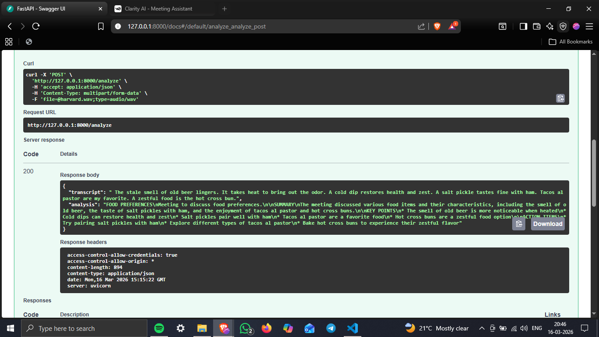

# Clarity AI – AI Meeting Assistant

Clarity AI is an intelligent meeting assistant that converts meeting audio into structured insights including transcripts, summaries, key points, and action items.

It helps users quickly understand long meetings without manually listening to recordings.

---

## Features

• Upload meeting audio files
• Automatic speech transcription
• AI-powered meeting summaries
• Key discussion points extraction
• Action items generation
• Simple API testing via Swagger UI

---

## Tech Stack

Frontend
• Next.js
• React
• Tailwind CSS

Backend
• FastAPI
• Python

AI
• Groq API

Deployment
• Vercel (Frontend)
• Cloud backend deployment

---

## Screenshots

### 1. Clarity AI Web Interface

.png)

---

### 2.Audio Upload & Results Page

.png)


---

### 3. FastAPI API Response


.png)

---

## How It Works

1. User uploads a meeting audio file
2. Backend processes the audio
3. AI generates transcript and insights
4. Results are returned as structured meeting notes

---

## Example API Output

```
{
 "transcript": "The meeting discussed food preferences...",
 "analysis": {
   "summary": "Discussion about various food items",
   "key_points": [
     "Old beer smell improves with heat",
     "Salt pickles pair with ham",
     "Tacos al pastor are popular"
   ],
   "action_items": [
     "Try pairing salt pickles with ham",
     "Explore different taco varieties"
   ]
 }
}
```

---

## Installation

Clone the repository

```
git clone https://github.com/yourusername/clarity-ai-meeting-assistant.git
```

Backend setup

```
cd backend
pip install -r requirements.txt
uvicorn main:app --reload
```

Frontend setup

```
cd frontend
npm install
npm run dev
```

---

## Future Improvements

• Real-time meeting transcription
• Speaker identification
• Meeting history dashboard
• Team collaboration features
• Export notes to PDF / Notion

---

## Author

Disha

---

## License

This project is open-source and available under the MIT License.
